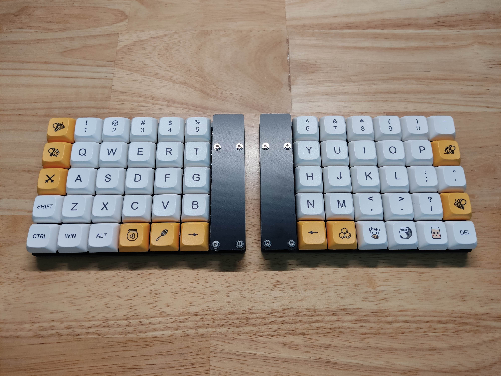
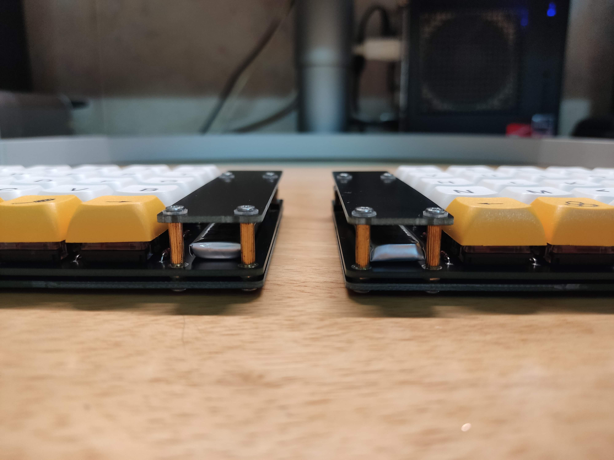
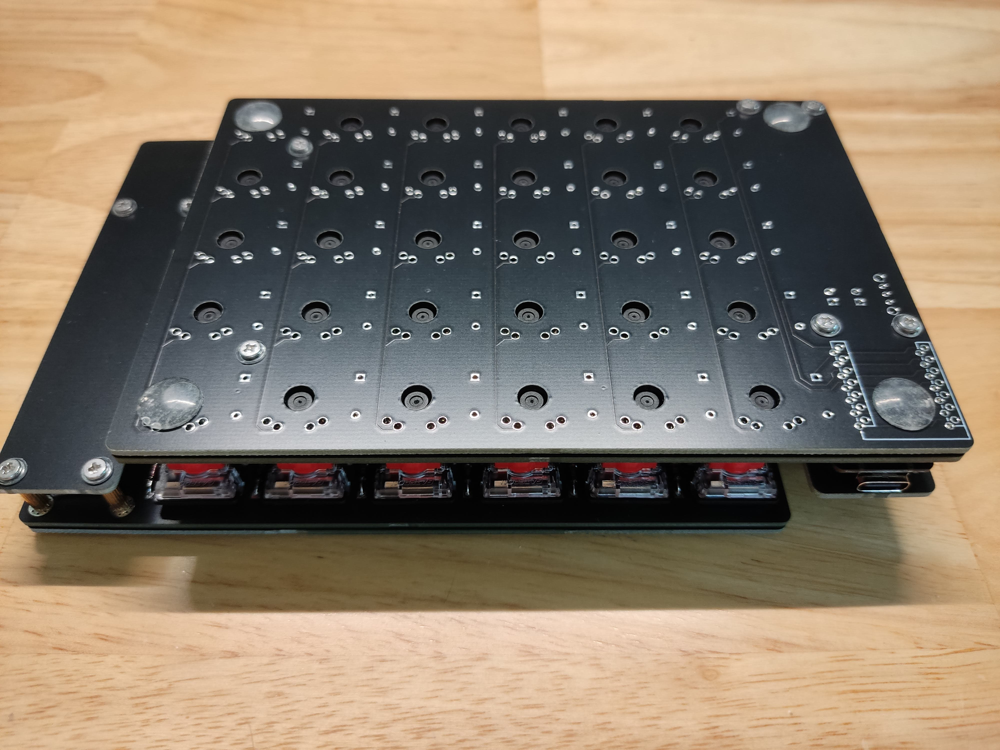
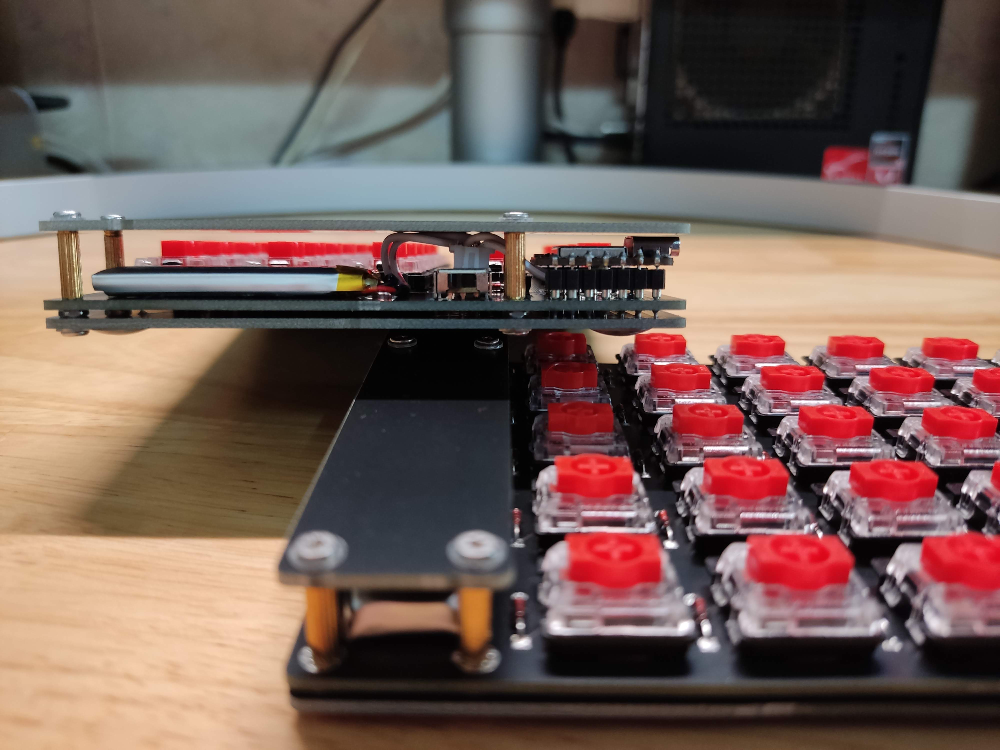

# xiao_256

Split keyboard with 5 rows & 6 columns on each half (hence the name 2 * 5 * 6) using xiao ble mcu & gateron low profile switch.

The pcb is reversible. A small pcb is also available to cover the mcu, the battery, & the wiring.

zmk config is available at https://github.com/vuanhtung/zmk-config

